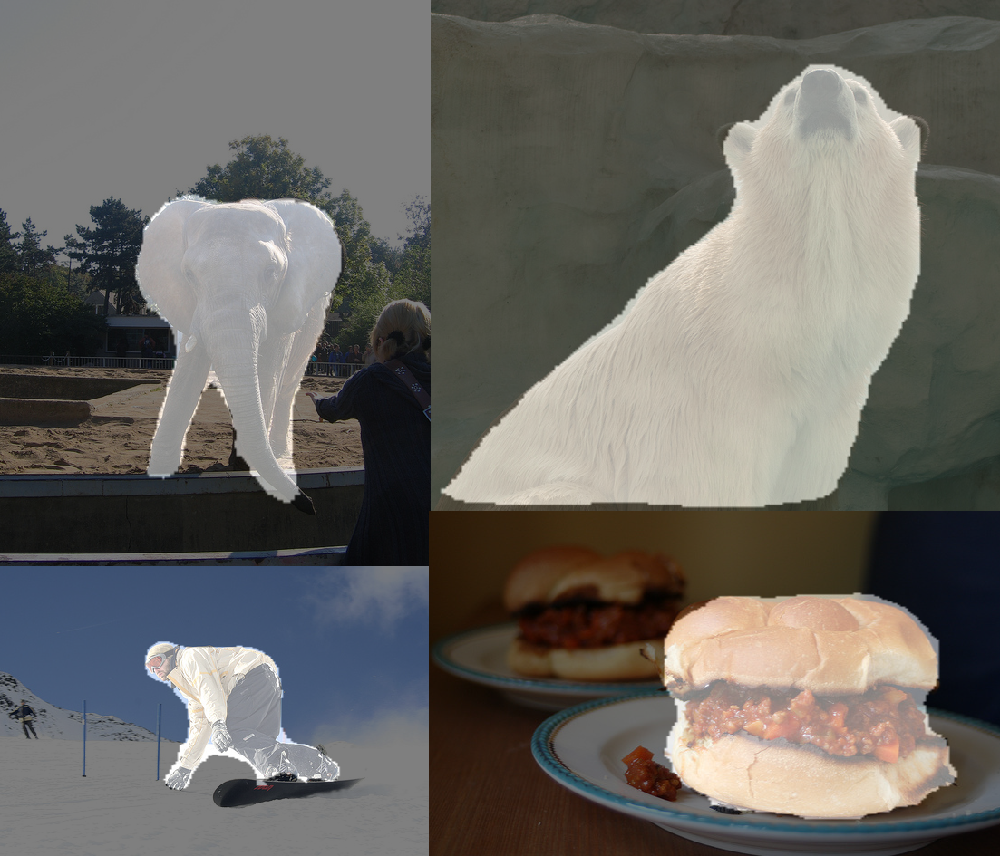

SharpMask
=========
DeepMask [1] and SharpMask [2] implementation on Python/TensorFlow.

Introduction
------------
The repository contains an implementation of DeepMask and SharpMask models. 
DeepMask model predicts class agnostic object mask and object score, which is positive if an object is centered and fully contained in an image. SharpMask is an extension of DeepMask architecture, which uses 
a top-down refinement module to compute more precise object mask proposal.

The implementation is based on TensorFlow official ResNet-v2 [3] model implementation and
requires pre-trained ResNet [weights](http://download.tensorflow.org/models/official/resnet_v2_imagenet_checkpoint.tar.gz "TensorFlow ResNet-v2 checkpoint").

ResNet model implementation is copied from the official TensorFlow [repository](https://github.com/tensorflow/models/tree/master/official/resnet).

Note, that variables in ResNet model checkpoint are explicitly placed on a GPU device. 
So they won't be restored on a CPU.

Quick start
------------
1. Clone this repository
   ```bash
   git clone https://github.com/aby2s/sharpmask.git
   ```
2. Download COCO-2017 train and validation sets from [here](http://cocodataset.org/#download "COCO download page") 
3. Unpack images into $COCO_PATH/images and annotations into $COCO_PATH/annotations, where
$COCO_PATH is any directory
4. Prepare tfrecord files by running
   ```bash
    python prepare_data.py --coco_path $COCO_PATH --train_path $TRAIN_PATH --validation_path $VAL_PATH
    ```
    where $TRAIN_PATH and $VAL_PATH are directories to store training and validation tfrecord files respectivly.
     
Now you are ready either to evaluate a pre-trained model or to train your one.

Training
-------- 
1. Download ResNet pre-trained weights from [here](http://download.tensorflow.org/models/official/resnet_v2_imagenet_checkpoint.tar.gz "TensorFlow ResNet-v2 checkpoint")
2. Run to train DeepMask and SharpMask sequentially
    ```bash
    python run_model.py --model all --train --train_path $TRAIN_PATH --validation_path $VAL_PATH  --summary_path $SUMMARY_PATH --checkpoint_path $CKPT_PATH --resnet_ckpt $RESNET_CKPT_PATH
    ```
3. To train only DeepMask run
    ```bash
    python run_model.py --model deepmask --train --train_path $TRAIN_PATH --validation_path $VAL_PATH  --summary_path $SUMMARY_PATH --checkpoint_path $CKPT_PATH --resnet_ckpt $RESNET_CKPT_PATH
    ```
4. To continue training or to train sharpmask from pre-trained deepmask use --restore flag
    ```bash
    python run_model.py --model sharpmask --restore --train --train_path $TRAIN_PATH --validation_path $VAL_PATH  --summary_path $SUMMARY_PATH --checkpoint_path $CKPT_PATH
    ```

Evaluation
----------
1. To run evaluation computing mean IOU on compiled coco validation set:
    ```bash
    python run_model.py --model sharpmask --restore --validate --validation_path $VAL_PATH  --summary_path $SUMMARY_PATH --checkpoint_path $CKPT_PATH
    ```
2. To apply object mask and calculate score on a single image run
    ```bash
    python run_model.py --model sharpmask --restore --evaluate --eval_source $EVAL_SOURCE --eval_target $EVAL_TARGET  --summary_path $SUMMARY_PATH --checkpoint_path $CKPT_PATH
    ```

Pre-trained weights
------------------
Pre-trained weights are available [here](https://drive.google.com/open?id=1o-u-8BxS_aNwgz022esOSEe4l-pvURJT)


Example
-------


[1]: https://arxiv.org/abs/1603.08695 "Pedro O. Pinheiro et al.: Learning to Segment Object Candidates"
[2]: https://arxiv.org/abs/1506.06204 "Pedro O. Pinheiro et al.: Learning to Refine Object Segments"
[3]: https://arxiv.org/abs/1512.03385 "Kaiming He et al.: Deep Residual Learning for Image Recognition"